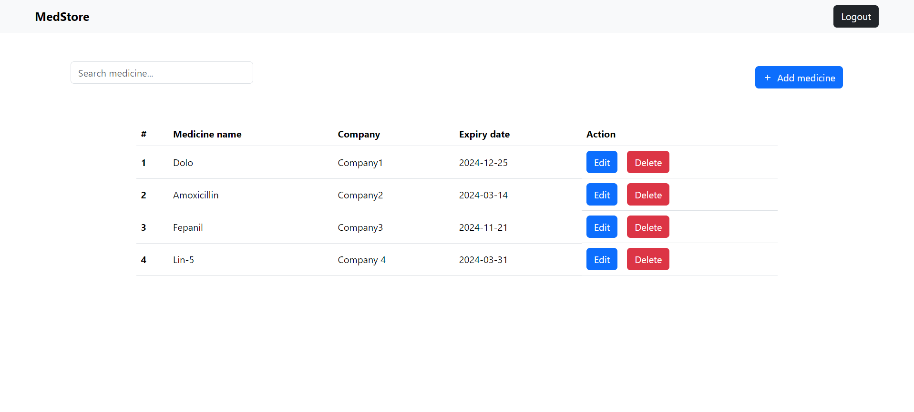

# Med Store Project



This is a Med-Store web application built by using the ReactJS

## Tech stack

**Client:** React, Bootstrap

**API:** `https://documenter.getpostman.com/view/7509819/2s8YzL4RUo`

# App Features

- User can view all the medicines
- User can add new medicine to the list
- User can search for specific medicine in the list
- User can edit medicines
- User can delete medicines
- Success & error message popups

# Start the app

Clone the Project

```
git clone https://github.com/its-sarath28/medStore-react.git
```

Go to project directory

```
cd [folder_name]
```

Install dependencies

```
npm install
```

Start the server

```
npm run dev
```
